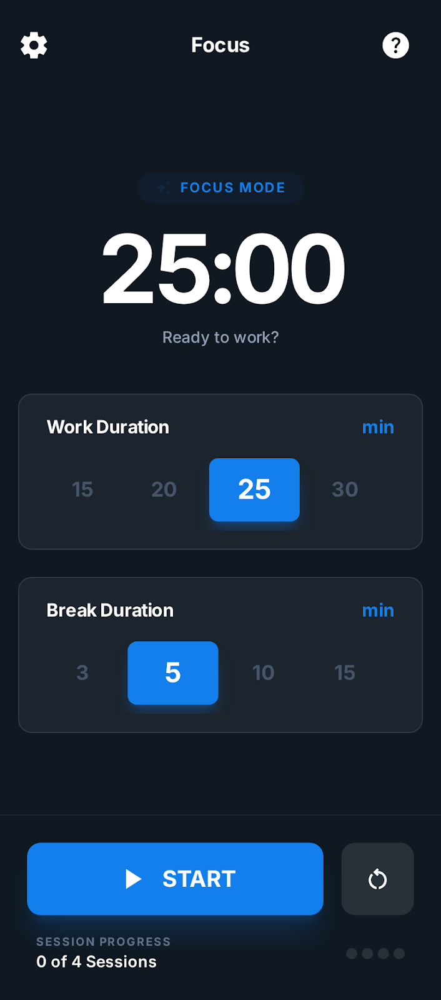
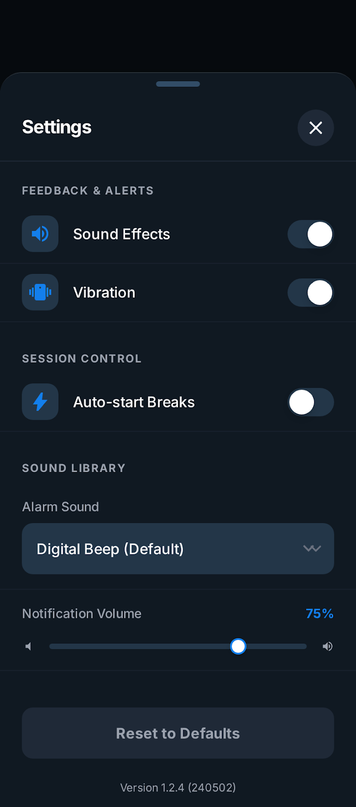
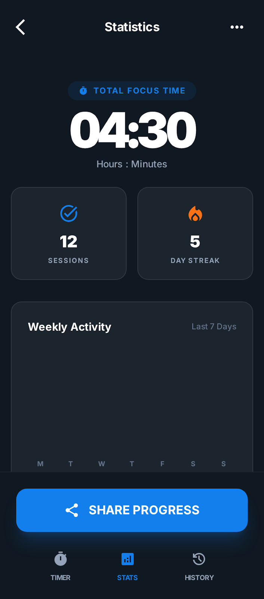

# Pomodoro

An Android Pomodoro app built as an architecture playground and an AI-assisted development experiment.

The project combines:

- strict Clean Architecture
- MVI presentation
- Jetpack Compose UI
- modular `api/impl` boundaries
- background reliability patterns for timer completion
- AI-ready development workflows (`AGENTS.md`, `.ai/WORKFLOW_FEATURE.md`, local Codex skills)

## Why This Project Exists

This repository is not just a Pomodoro app. It is also a practical sandbox to validate how AI can be integrated into day-to-day Android development without losing engineering rigor.

Primary goals:

- build a reliable timer experience (including locked screen scenarios)
- keep the codebase highly testable and maintainable over time
- use AI to accelerate implementation while enforcing architecture guardrails

## Product Overview

Current implemented flows:

- **Pomodoro Timer**
- Work and short-break duration selection
- Start, pause, resume, skip, stop, and reset actions
- Auto-start break/work options
- Exact alarm permission warning flow
- Running timer foreground notification
- Completion notifications scheduled with exact alarms

- **Settings**
- Analytics consent toggle
- Notification permission and exact alarm guidance
- Notification channel settings shortcut
- Completion alarm sound label display

- **Statistics**
- Weekly/monthly activity visualization
- Focus/break/total time metrics
- Sessions completed and day streak KPIs
- Share progress action

## Screenshots

| Launch | Timer |
| --- | --- |
|  |  |

| Settings | Statistics |
| --- | --- |
|  |  |

## Architecture

The codebase follows strict module boundaries and keeps domain logic framework-agnostic.

- **Clean Architecture**
- Domain stays pure Kotlin (no Android or SDK dependencies)
- Data and presentation are isolated by feature/module

- **MVI in presentation**
- `UiState`, `UiAction`, `UiEffect`, and ViewModel orchestration

- **Compose-first UI**
- Route + Screen split per screen
- reusable UI in `presentation/components`
- centralized design system in `core/design-system`

- **Navigation**
- `androidx.navigation3`
- navigation contracts in `core/navigation`
- wiring in `app`

- **Centralized scaffold**
- single app scaffold with shared top/bottom bars (`core/ui`)

## Module Layout

The project currently includes 29 Gradle modules:

```text
app
core/
  appconfig/api + appconfig/impl
  design-system
  domain
  navigation
  resources
  testing
  ui
features/
  pomodoro-timer/api + impl
  settings/api + impl
  statistics/api + impl
libs/
  analytics/api + impl
  crashlytics/api + impl
  datastore/api + impl
  logger/api + impl
  notifications/api + impl
  permissions/api + impl
  usage-stats/api + impl
build-logic/
  convention plugins
```

## Reliability and Background Execution

Background behavior is implemented in `libs/notifications`:

- `AlarmManager.setExactAndAllowWhileIdle(...)` for precise completion alarms
- `AlarmReceiver` for delivery
- `ReconciliationReceiver` for `BOOT_COMPLETED`, time, and timezone changes
- foreground service (`PomodoroTimerForegroundService`) for running timer visibility

Configuration and internal state persistence:

- DataStore preferences via `libs/datastore`
- Room-backed usage metrics via `libs/usage-stats`

## Tech Stack

- Kotlin `2.3.0`
- AGP `9.0.0`
- Gradle `9.1.0`
- Compose BOM `2026.01.01`
- Navigation3 (`androidx.navigation3`)
- Koin for DI
- Room + KSP
- DataStore
- Timber
- Firebase Analytics and Crashlytics (wrapped by provider-agnostic interfaces)
- JUnit5, MockK, Kluent, Turbine
- Roborazzi + Robolectric for screenshot tests
- Detekt + Ktlint

## AI-Assisted Development Workflow

This repository is optimized for AI collaboration with explicit constraints.

- `AGENTS.md`
  - binding engineering rules (architecture, module boundaries, testing standards, anti-patterns)

- `.ai/WORKFLOW_FEATURE.md`
  - step-by-step feature workflow intended for AI-assisted execution

- `.codex/skills/...`
  - reusable skills for architecture guardrails, testing patterns, background execution, and workflow authoring

Recommended loop:

1. Define feature/task context (including screenshots or requirements).
2. Execute with AI while enforcing `AGENTS.md`.
3. Validate with quality gates (`ktlint`, `detekt`, lint, tests, Roborazzi).
4. Open PR only when all checks pass.

## Getting Started

### Prerequisites

- JDK 21
- Android SDK configured (`local.properties`)
- Android Studio (recent version with AGP 9 support)

### Firebase setup

`app/google-services.json` is required for Firebase-enabled builds and is intentionally gitignored.

Add your local file:

```bash
cp /path/to/your/google-services.json app/google-services.json
```

### Build debug APK

```bash
./gradlew :app:assembleDebug
```

### Run unit tests

```bash
./gradlew test
```

## Quality Gates

Run static analysis and verification:

```bash
./gradlew ktlintCheck
./gradlew detekt
./gradlew lintDebug
./gradlew verifyRoborazziDebug
```

Targeted examples:

```bash
./gradlew :features:pomodoro-timer:impl:testDebugUnitTest
./gradlew :features:settings:impl:verifyRoborazziDebug
./gradlew :core:design-system:verifyRoborazziDebug
```

## CI

GitHub Actions workflow (`.github/workflows/android-ci.yml`) runs on push/PR to `main`:

1. `ktlintCheck`
2. `detekt`
3. `lintDebug`
4. `:app:assembleDebug`
5. `test`
6. `verifyRoborazziDebug`

## Git Hooks

Install local pre-commit checks:

```bash
./scripts/install-hooks.sh
```

The hook validates staged Kotlin files and runs:

- `ktlintCheck` (and `ktlintFormat` auto-fix when needed)
- `detekt`

## Contributing

Before submitting changes:

1. Follow architecture constraints in `AGENTS.md`.
2. Keep module boundaries (`api/impl`) intact.
3. Avoid Android dependencies in domain.
4. Use design-system components instead of raw Material3 in features.
5. Ensure all required checks pass locally.

## Notes

- Release/instrumentation test infrastructure is intentionally out of scope for now.
- The project is intentionally strict to keep AI-generated contributions predictable and safe.
